# 📊 خرائط تدفق البيانات والمنطق
## Data Flow Diagrams & Flowcharts

> **الغرض:** توضيح سير عمل نظام الرواتب بصرياً  
> **الجمهور:** جميع المستويات التقنية

---

## 📋 الفهرس

1. [نظرة عامة على النظام](#نظرة-عامة-على-النظام)
2. [تدفق حساب الرواتب](#تدفق-حساب-الرواتب)
3. [تدفق المسحوبات العينية](#تدفق-المسحوبات-العينية)
4. [تدفق البيانات في قاعدة البيانات](#تدفق-البيانات-في-قاعدة-البيانات)
5. [سيناريوهات الاستخدام](#سيناريوهات-الاستخدام)

---

## نظرة عامة على النظام

### البنية الأساسية

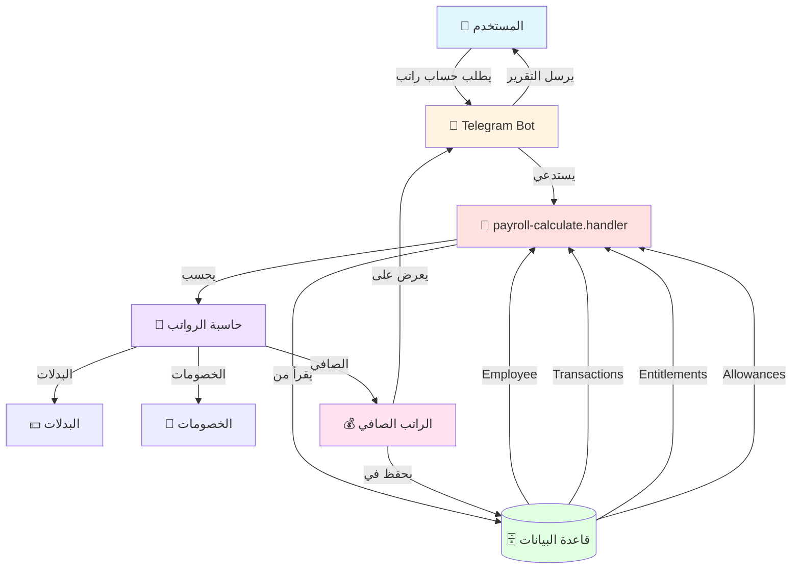

---

## تدفق حساب الرواتب

### المخطط الشامل

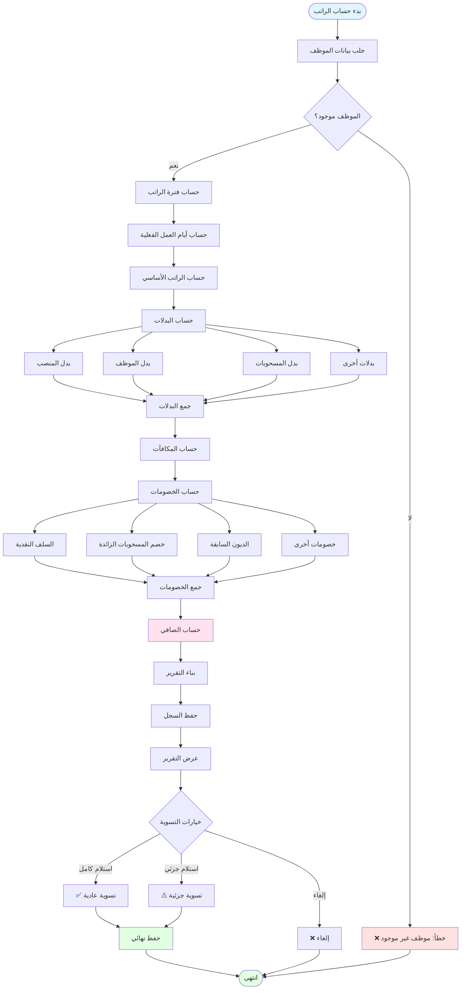

---

## تدفق المسحوبات العينية

### التدفق الحالي (المشكلة)

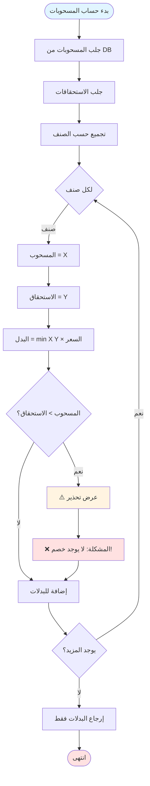

### التدفق المصحح (الحل)

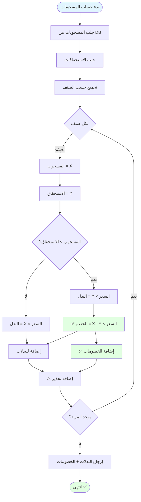

---

## تدفق البيانات في قاعدة البيانات

### علاقات الجداول

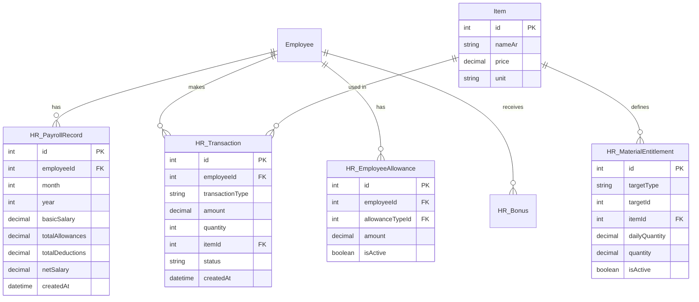

### مسار البيانات من DB إلى التقرير

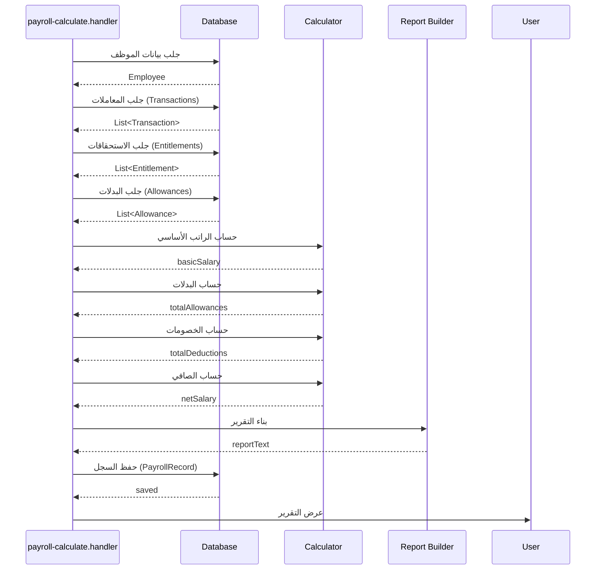

---

## سيناريوهات الاستخدام

### السيناريو 1: راتب عادي (بدون مشاكل)

```mermaid
flowchart LR
    Input[المدخلات] --> Process[المعالجة] --> Output[المخرجات]
    
    subgraph Input
        E1[الموظف: أحمد]
        E2[الراتب الأساسي: 5000]
        E3[أيام العمل: 30]
        E4[بدل منصب: 500]
        E5[بدل موظف: 200]
        E6[مسحوبات: 1 علبة]
        E7[استحقاق: 1 علبة]
    end
    
    subgraph Process
        P1[الأساسي = 5000]
        P2[البدلات = 500 + 200 + 55]
        P3[الخصومات = 0]
        P4[الصافي = 5000 + 755]
    end
    
    subgraph Output
        O1[الراتب الصافي: 5755 ج]
        O2[✅ لا توجد مشاكل]
    end
    
    style Input fill:#e1f5ff
    style Process fill:#fff4e1
    style Output fill:#e1ffe1
```

### السيناريو 2: راتب مع زيادة في المسحوبات

```mermaid
flowchart LR
    Input[المدخلات] --> Process[المعالجة] --> Output[المخرجات]
    
    subgraph Input
        E1[الموظف: صالح]
        E2[الراتب الأساسي: 4000]
        E3[أيام العمل: 30]
        E4[بدل منصب: 0]
        E5[بدل موظف: 0]
        E6[مسحوبات: 5 علبات]
        E7[استحقاق: 1 علبة]
    end
    
    subgraph Process
        P1[الأساسي = 4000]
        P2[البدلات = 0 + 0 + 55]
        P3[الخصومات = 220]
        P4[الصافي = 4000 + 55 - 220]
    end
    
    subgraph Output
        O1[الراتب الصافي: 3835 ج]
        O2[⚠️ تحذير: زيادة 4 علبات]
    end
    
    style Input fill:#e1f5ff
    style Process fill:#fff4e1
    style Output fill:#ffe1f0
```

### السيناريو 3: راتب مع سلفة

```mermaid
flowchart LR
    Input[المدخلات] --> Process[المعالجة] --> Output[المخرجات]
    
    subgraph Input
        E1[الموظف: محمد]
        E2[الراتب الأساسي: 6000]
        E3[أيام العمل: 30]
        E4[بدل منصب: 800]
        E5[سلفة نقدية: 2000]
    end
    
    subgraph Process
        P1[الأساسي = 6000]
        P2[البدلات = 800]
        P3[الخصومات = 2000]
        P4[الصافي = 6000 + 800 - 2000]
    end
    
    subgraph Output
        O1[الراتب الصافي: 4800 ج]
        O2[ℹ️ تم خصم السلفة]
    end
    
    style Input fill:#e1f5ff
    style Process fill:#fff4e1
    style Output fill:#e1ffe1
```

### السيناريو 4: تسوية جزئية (دين)

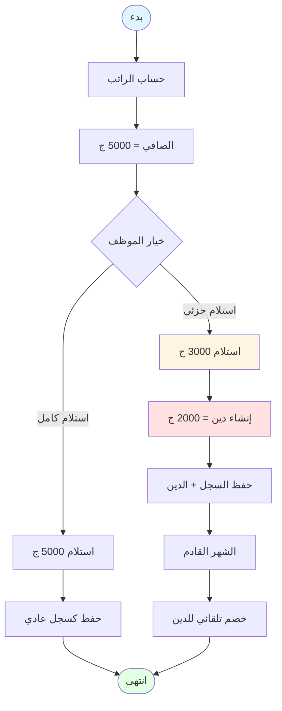

---

## الحالات الخاصة

### معالجة الأخطاء

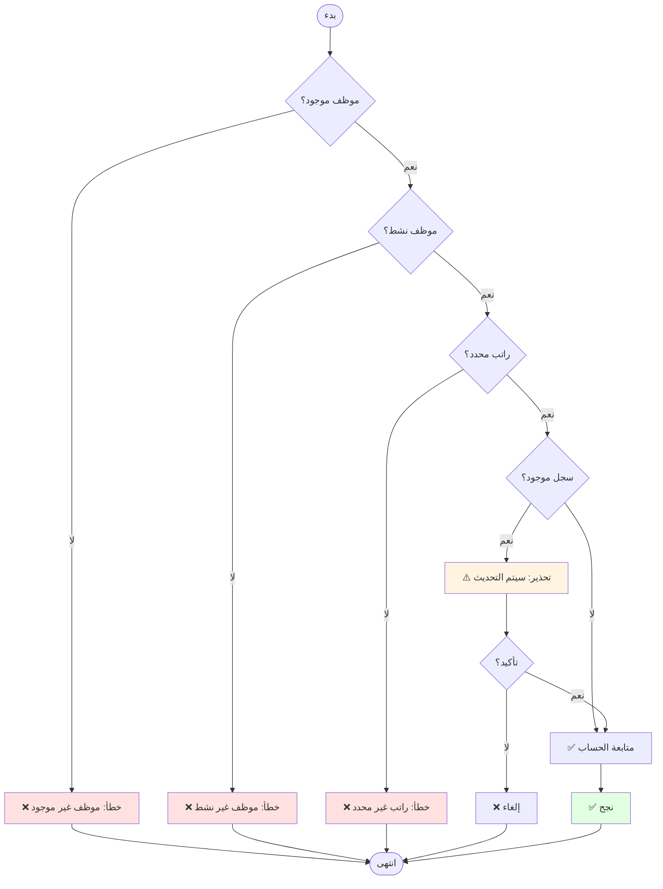

---

## المقارنة: قبل وبعد الإصلاح

### قبل الإصلاح

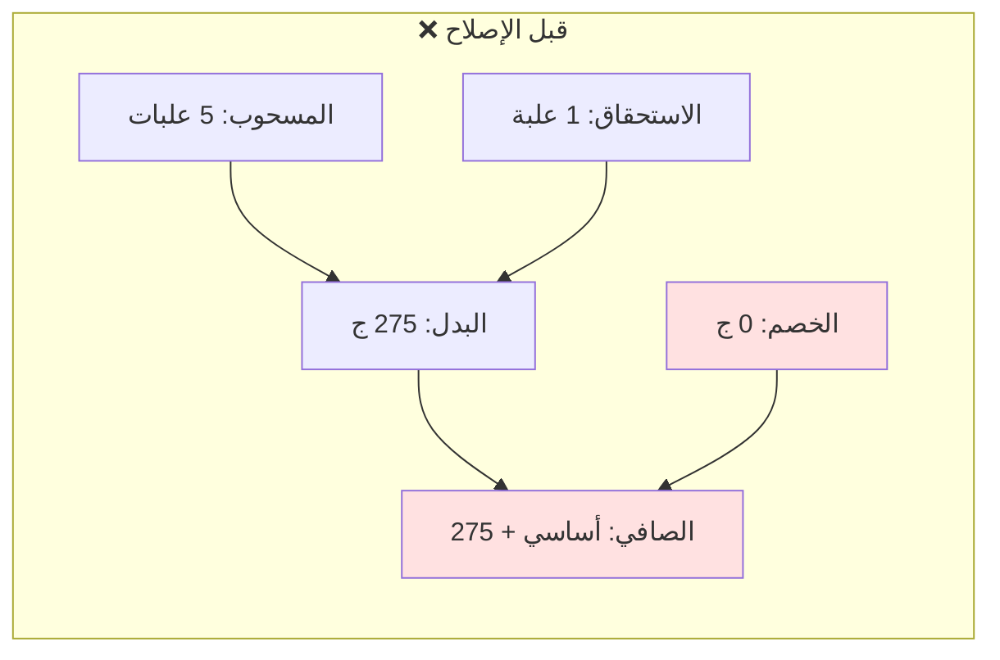

### بعد الإصلاح

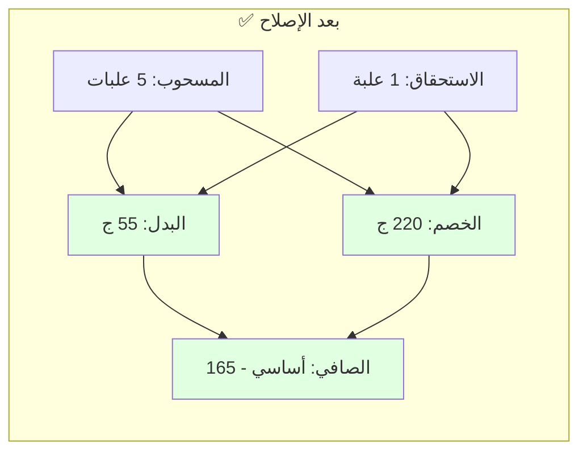

---

## خريطة التدفق الزمني

```mermaid
gantt
    title خط زمني لمعالجة الراتب
    dateFormat X
    axisFormat %s
    
    section جلب البيانات
    بيانات الموظف         :0, 100
    المعاملات              :100, 200
    الاستحقاقات            :200, 150
    
    section الحسابات
    الراتب الأساسي         :350, 50
    البدلات                :400, 100
    المسحوبات العينية      :500, 150
    الخصومات               :650, 100
    
    section النتيجة
    حساب الصافي            :750, 50
    بناء التقرير           :800, 100
    حفظ السجل              :900, 100
    عرض النتيجة            :1000, 50
```

---

## الملخص

### النقاط الرئيسية:

```
✅ التدفق العام:
   جلب البيانات → الحساب → الحفظ → العرض

✅ المكونات الأساسية:
   الراتب الأساسي + البدلات - الخصومات = الصافي

⚠️ المشكلة المكتشفة:
   المسحوبات الزائدة لا تُخصم

✅ الحل:
   إضافة منطق الخصم للزيادة
```

---

**روابط ذات صلة:**
- [03_DATABASE_ANALYSIS.md](./03_DATABASE_ANALYSIS.md) - تحليل قاعدة البيانات
- [04_FILES_ANALYSIS.md](./04_FILES_ANALYSIS.md) - تحليل الملفات
- [05_BUSINESS_LOGIC_ANALYSIS.md](./05_BUSINESS_LOGIC_ANALYSIS.md) - تحليل المنطق

