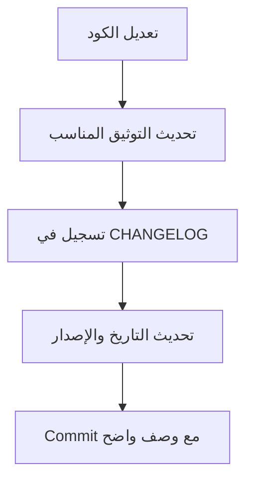

# 👥 توثيق نظام إدارة الموارد البشرية
## HR Management System Documentation

<div align="center">


**مصدر الحقيقة الوحيد - Single Source of Truth**

[📚 التوثيق](#-الملفات) • [🚀 البدء السريع](#-البدء-السريع) • [📊 الإحصائيات](#-الإحصائيات) • [🆕 الجديد](#-الجديد-في-الإصدار-30)

</div>

---

## 📖 نبذة

هذا المجلد يحتوي على **التوثيق الشامل المحدث** لنظام إدارة الموارد البشرية - نظام متكامل واحترافي يعمل عبر **Telegram Bot** لإدارة جميع شؤون الموظفين من التوظيف حتى التقاعد.

### ✨ المميزات الرئيسية:

- 🤖 **أتمتة كاملة:** عقوبات تلقائية، إشعارات ذكية، Cron Jobs
- 🔒 **نظام إيقاف متقدم:** إيقاف تلقائي مع إيقاف الراتب
- 💰 **حسابات معقدة:** رواتب يومية وشهرية دقيقة 100%
- 📊 **تقارير شاملة:** 20+ تقرير تحليلي
- 🗄️ **قاعدة بيانات قوية:** 25 جدول مترابط

---

## 🎯 الهدف

هذا التوثيق هو **المصدر الرسمي الوحيد** (Single Source of Truth) لجميع المعلومات المتعلقة بنظام إدارة الموارد البشرية، ويتم تحديثه مع كل تطوير في النظام.

---

## 📚 الملفات

### 🌟 **ابدأ من هنا:**

| الملف | الوصف | للقراءة | الحالة |
|------|-------|---------|--------|
| **[USER_GUIDE.md](./USER_GUIDE.md)** ⭐⭐⭐ | **دليل المستخدم الشامل** - للجميع | ⏱️ 30 دقيقة | ✅ محدث |
| [00_INDEX.md](./00_INDEX.md) | الفهرس الرئيسي وخريطة التوثيق | ⏱️ 5 دقائق | ✅ محدث |

### 📘 **التوثيق التقني:**

| الملف | الوصف | للقراءة | الحالة |
|------|-------|---------|--------|
| [01_SYSTEM_OVERVIEW.md](./01_SYSTEM_OVERVIEW.md) | نظرة شاملة على النظام بالكامل | ⏱️ 20 دقيقة | ✅ محدث |
| [02_DATABASE_SCHEMA.md](./02_DATABASE_SCHEMA.md) | هيكل قاعدة البيانات الكامل (25 جدول) | ⏱️ 30 دقيقة | ✅ محدث |
| [03_EMPLOYEES_MANAGEMENT.md](./03_EMPLOYEES_MANAGEMENT.md) | نظام إدارة العاملين | ⏱️ 25 دقيقة | ⚠️ قديم |

### 📕 **أنظمة متخصصة:**

| الملف | الوصف | الحالة |
|------|-------|--------|
| [11_WORK_LEAVE_CYCLE_SYSTEM.md](./11_WORK_LEAVE_CYCLE_SYSTEM.md) | دورات العمل والإجازة (للبحارة) | ✅ محدث |
| [WORK_LEAVE_CYCLE_QUICK_GUIDE.md](./WORK_LEAVE_CYCLE_QUICK_GUIDE.md) | دليل سريع لدورات العمل | ✅ محدث |
| [WORK_LEAVE_CYCLE_VISUAL_SUMMARY.md](./WORK_LEAVE_CYCLE_VISUAL_SUMMARY.md) | ملخص بصري لدورات العمل | ✅ محدث |

### 📗 **سجلات:**

| الملف | الوصف | الحالة |
|------|-------|--------|
| [CHANGELOG.md](./CHANGELOG.md) | سجل جميع التغييرات والتحديثات | ✅ محدث |

---

## 🆕 الجديد في الإصدار 3.0

### 🌟 **ميزات ثورية:**

#### 1. نظام الإيقاف عن العمل 🚫
- إيقاف تلقائي عند الموافقة على عقوبة
- إيقاف الراتب من تاريخ بداية الإجازة
- رفع الإيقاف (بدون عقوبة / مع خصم أيام)

#### 2. العقوبات التلقائية ⚡
- Cron Job يومي الساعة 9 صباحاً
- كشف تأخير العودة (5+ أيام) تلقائياً
- إنشاء عقوبات بدون تدخل بشري
- إشعارات فورية ويومية

#### 3. نظام الرواتب المحسّن �
- خصم الإجازات بدون مرتب (شهري)
- حد الراتب للموظف الموقوف
- تقرير راتب واضح ومفصل
- عرض وصف المكافأة

#### 4. إصلاحات الإجازات 🏖️
- إصلاح تعارض التواريخ
- إخفاء الموقوفين من القوائم
- منع تسجيل عودة للموقوفين

### 📊 الإحصائيات:
- **ملفات جديدة:** 6 ملفات
- **ملفات محدثة:** 9 ملفات
- **أسطر كود جديدة:** ~2,000
- **أسطر توثيق جديدة:** ~2,300

---

## 🚀 البدء السريع

### للمستخدم الجديد:
1. ✅ اقرأ **[دليل المستخدم](./USER_GUIDE.md)** ← ابدأ من هنا!
2. ✅ راجع قسم "البدء السريع"
3. ✅ اقرأ القسم الذي تحتاجه فقط

### للمطور الجديد:
1. ✅ اقرأ **[نظرة عامة على النظام](./01_SYSTEM_OVERVIEW.md)**
2. ✅ ادرس **[هيكل قاعدة البيانات](./02_DATABASE_SCHEMA.md)**
3. ✅ راجع الكود مع التوثيق

### للمدير:
1. ✅ اقرأ **[نظرة عامة](./01_SYSTEM_OVERVIEW.md)** (الأنظمة الفرعية)
2. ✅ راجع **[دليل المستخدم](./USER_GUIDE.md)** (الأقسام المهمة)


| `08_PERMISSIONS_SYSTEM.md` | الصلاحيات والإدارة | 🔜 قريباً |
| `09_TECHNICAL_DETAILS.md` | التفاصيل التقنية | 🔜 قريباً |
| [`11_WORK_LEAVE_CYCLE_SYSTEM.md`](./11_WORK_LEAVE_CYCLE_SYSTEM.md) | نظام دورة العمل والإجازات | ✅ جاهز |

### **📗 الملفات الداعمة:**
| الملف | الوصف |
|------|-------|
| [`10_CHANGELOG.md`](./10_CHANGELOG.md) | سجل جميع التغييرات والتحديثات |
| [`Assets/`](./Assets/) | مجلد الصور والمرفقات |

---

## 🚀 البدء السريع

### **للمطورين الجدد:**


**⏱️ الوقت المتوقع:** ساعة واحدة

### **للمستخدمين:**

1. اقرأ [`QUICK_GUIDE.md`](./QUICK_GUIDE.md)
2. راجع الأسئلة الشائعة
3. ابدأ الاستخدام

**⏱️ الوقت المتوقع:** 10 دقائق

---

## 📊 الإحصائيات

<div align="center">

| المقياس | العدد |
|---------|-------|
| 📁 ملفات Handler | 52 |
| 🎯 وظائف رئيسية | 6 |
| 💼 وظائف فرعية | 25+ |
| 🗄️ جداول قاعدة البيانات | 15+ |
| 📝 أسطر برمجية | 10,000+ |
| 📚 ملفات توثيق | 7 (حالياً) |

</div>

---

## 🎨 الوظائف الرئيسية

```
👥 قسم شئون العاملين
│
├── 📋 قوائم العاملين
│   └── إضافة، تعديل، تصفية، بحث، تصدير
│
├── 💰 السلف والمسحوبات
│   └── نقدية، عينية، ديون، تسويات
│
├── 🏖️ الإجازات والمأموريات
│   └── 4 أنواع إجازات، مأموريات، عقوبات
│
├── 💵 الرواتب والأجور
│   └── بدلات، مكافآت، حساب متقدم
│
├── 📊 التقارير المخصصة
│   └── تقارير احترافية، تصدير Excel
│
└── ⚙️ إدارة القسم
    └── صلاحيات، تعيين أدمن، إدارة
```

---

## 🔄 دورة التحديث

### **عند إجراء تعديل:**



### **الالتزام:**
- ✅ تحديث التوثيق **فور** إجراء التعديل
- ✅ تسجيل التغيير في `10_CHANGELOG.md`
- ✅ تحديث التاريخ في الملفات المتأثرة
- ✅ مراجعة دقة المعلومات

---

## 📖 دليل القراءة

### **حسب الدور:**

#### **مطور جديد:**
```
1. QUICK_GUIDE.md
2. 01_OVERVIEW.md
3. 02_DATABASE_SCHEMA.md
4. الوظيفة المطلوبة
5. 09_TECHNICAL_DETAILS.md
```

#### **مطور متمرس:**
```
1. 10_CHANGELOG.md (آخر التحديثات)
2. الوظيفة المطلوبة
3. 02_DATABASE_SCHEMA.md (عند الحاجة)
```

#### **مدير المشروع:**
```
1. 01_OVERVIEW.md
2. 10_CHANGELOG.md
3. الإحصائيات في README
```

#### **مستخدم نهائي:**
```
1. QUICK_GUIDE.md
2. الأسئلة الشائعة
3. الوظيفة المطلوبة
```

---

## 🛠️ التقنيات المستخدمة

<div align="center">

| التقنية | الاستخدام |
|---------|-----------|
| 💻 TypeScript | لغة البرمجة الأساسية |
| 🤖 Grammy | إطار عمل بوت التليجرام |
| 🗄️ Prisma | ORM لقاعدة البيانات |
| 🐘 PostgreSQL | قاعدة البيانات |
| 📊 ExcelJS | تصدير Excel |
| 🎨 InlineKeyboard | واجهة المستخدم |

</div>

---

## ✨ المميزات البارزة

### **🎨 واجهة مستخدم تفاعلية:**
- نماذج متعددة الخطوات
- تقويم تفاعلي
- تصفية وبحث متقدم
- تصدير احترافي

### **🧮 حسابات دقيقة:**
- رواتب مقسطة حسب أيام العمل
- خصومات وبدلات تلقائية
- تتبع مالي كامل
- تقارير مفصلة

### **🔐 أمان محكم:**
- نظام صلاحيات متقدم
- تتبع جميع الإجراءات
- سجلات تدقيق
- حماية البيانات

### **📊 تقارير احترافية:**
- تصدير Excel
- أرقام عربية
- تنسيق جذاب
- إحصائيات ذكية

---

## 🔮 الخطة المستقبلية

### **قريباً:**
- [ ] استكمال التوثيق (6 ملفات متبقية)
- [ ] اختبار شامل للوظائف
- [ ] إصلاح المشاكل المكتشفة
- [ ] تحسين الأداء

### **مخطط له:**
- [ ] لوحة تحكم إحصائية
- [ ] ذكاء اصطناعي للتنبؤات
- [ ] تطبيق ويب مكمّل
- [ ] إشعارات ذكية متقدمة

---

## 🤝 المساهمة

### **كيف تساهم:**

1. **التوثيق:**
   - تحسين الشروحات الموجودة
   - إضافة أمثلة عملية
   - ترجمة (إن لزم)

2. **التطوير:**
   - اتباع الأنماط الموجودة
   - كتابة كود نظيف
   - توثيق التغييرات

3. **الاختبار:**
   - اكتشاف الأخطاء
   - اقتراح تحسينات
   - مشاركة الملاحظات

---

## 📞 التواصل

### **للمساعدة:**
- 📖 راجع التوثيق أولاً
- 🔍 ابحث في سجل التغييرات
- 💬 تواصل مع فريق التطوير

### **للإبلاغ عن مشكلة:**
- وصف واضح للمشكلة
- خطوات إعادة الإنتاج
- لقطة شاشة (إن أمكن)
- رسالة الخطأ

---

## 📜 الترخيص

هذا التوثيق جزء من مشروع **بوت تليجرام السعادة** ويخضع لسياسات الشركة.

---

## 🙏 الشكر والتقدير

شكراً لجميع المطورين والمساهمين في بناء وتطوير هذا النظام المتقدم.

---

## 🔄 آخر تحديث

- **التاريخ:** 7 نوفمبر 2025
- **الإصدار:** 3.0
- **الحالة:** Production Ready ✅
- **التغييرات الرئيسية:** 
  - نظام الإيقاف عن العمل
  - العقوبات التلقائية (Auto-Penalties)
  - تحسينات نظام الرواتب
  - إعادة كتابة التوثيق بالكامل

---

<div align="center">

**🌟 نظام احترافي متكامل جاهز للإنتاج 🌟**

*مصدر الحقيقة الوحيد - Single Source of Truth*

**📚 جميع الحقوق محفوظة © 2025**

[⬆️ العودة للأعلى](#-توثيق-نظام-إدارة-الموارد-البشرية)

</div>

