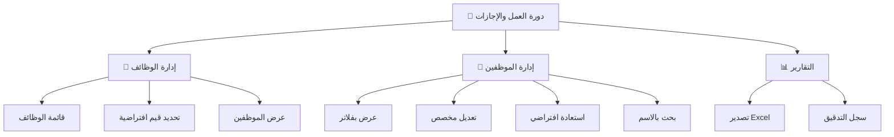
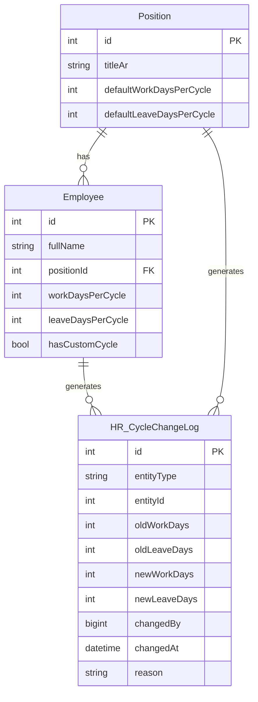
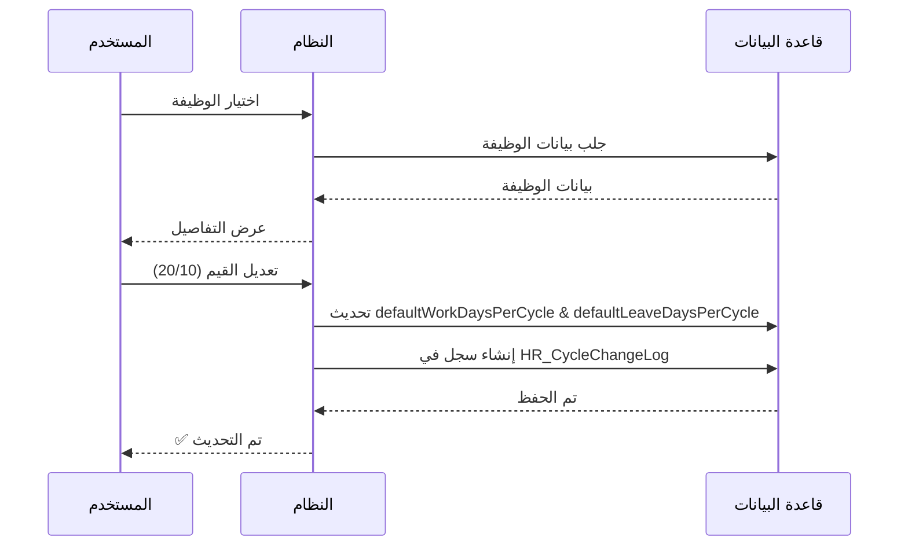
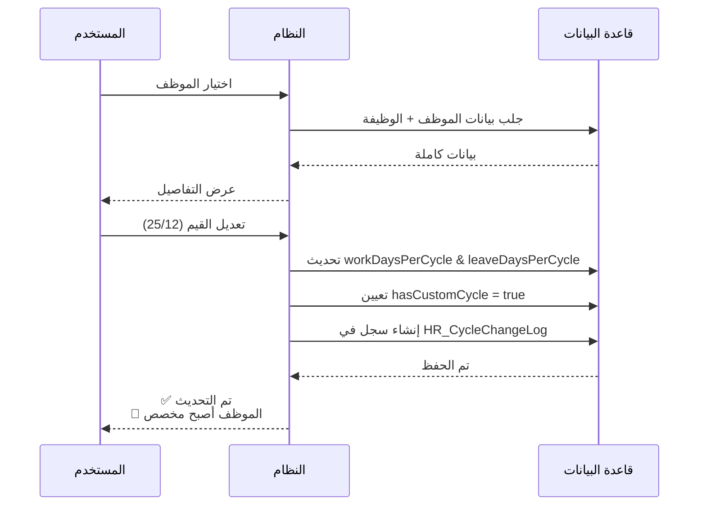
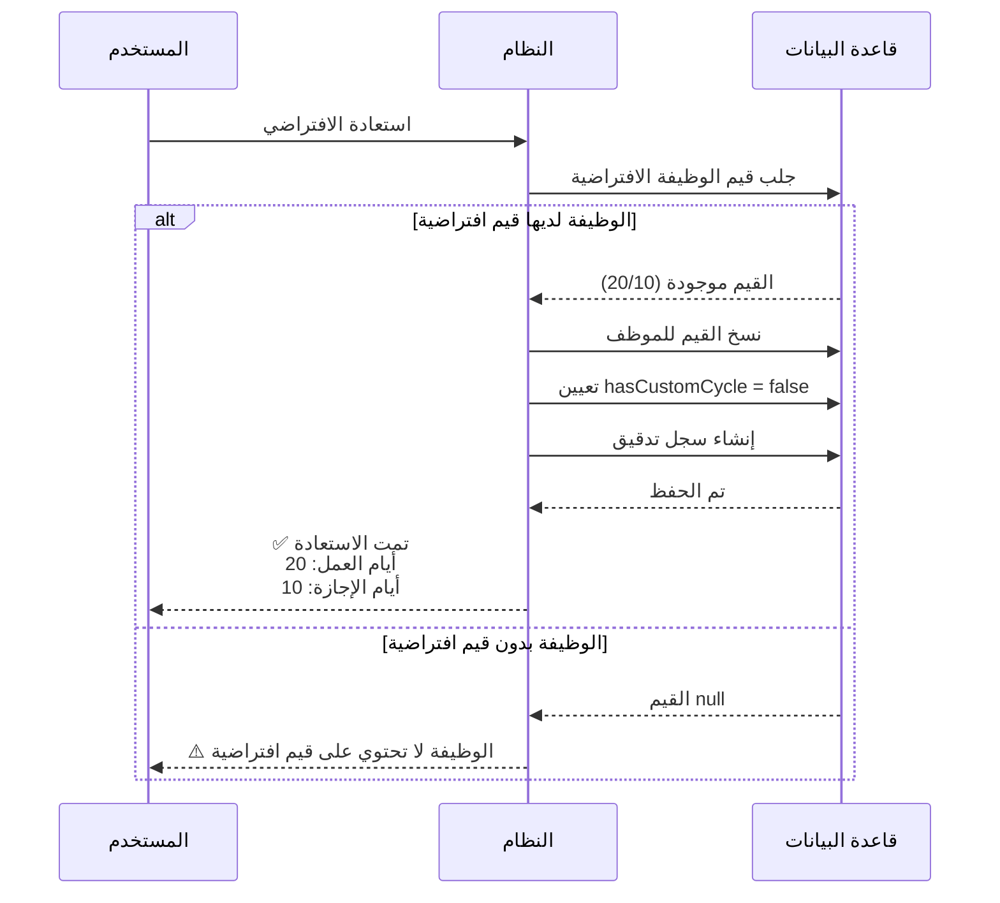
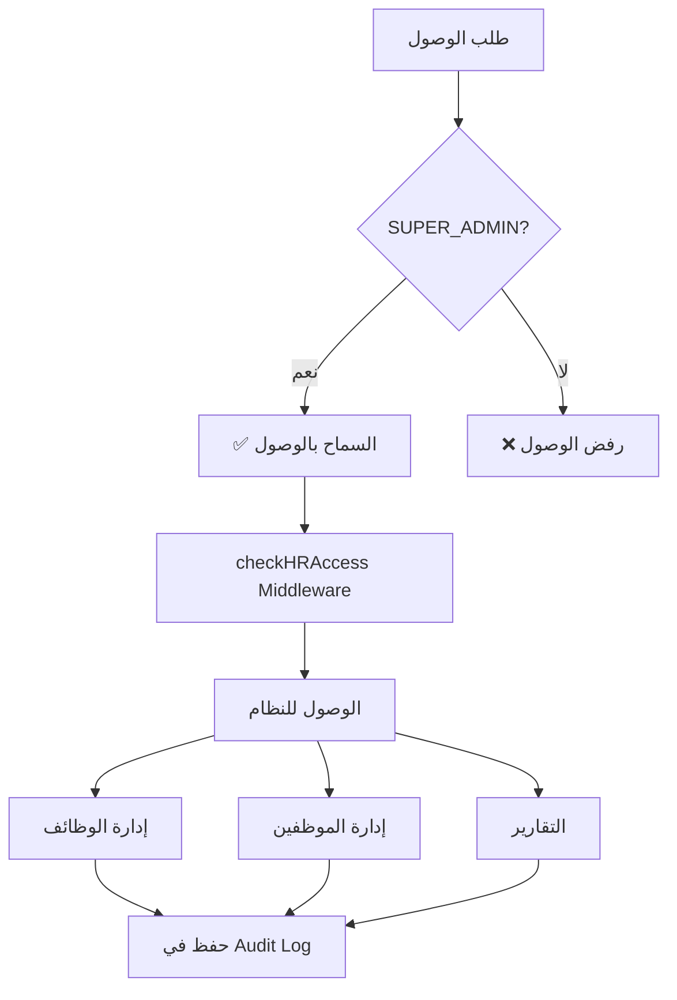
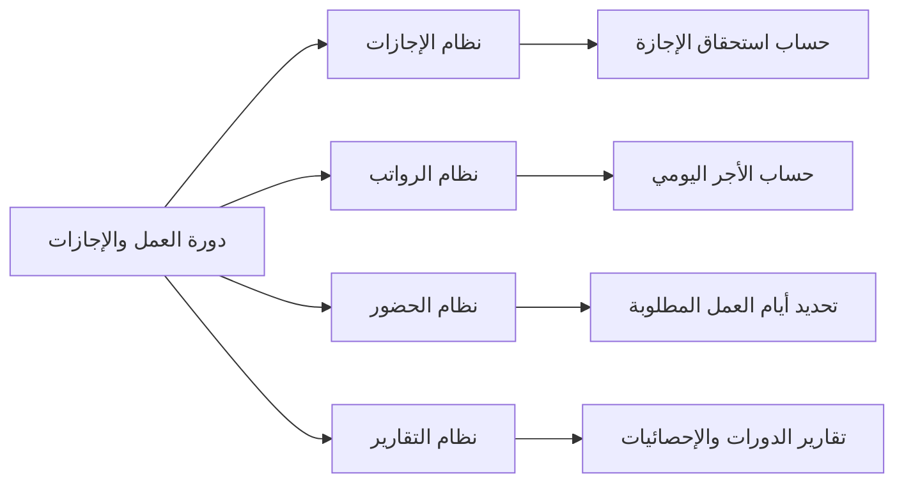

# 🔄 نظام دورة العمل والإجازات - الملخص المرئي

## 📊 نظرة عامة سريعة



---

## 🏗️ البنية الهرمية

```
📋 إدارة دورة العمل والإجازات
│
├── 🏢 إدارة دورات الوظائف
│   ├── قائمة الوظائف (مع عدد الموظفين)
│   ├── عرض تفاصيل الوظيفة
│   ├── تعديل القيم الافتراضية
│   └── عرض موظفي الوظيفة
│
├── 👤 إدارة دورات الموظفين
│   ├── قائمة الموظفين
│   │   ├── 📋 جميع الموظفين
│   │   ├── ✅ افتراضي فقط
│   │   ├── 🔧 مخصص فقط
│   │   └── ❌ غير محدد
│   ├── عرض تفاصيل الموظف
│   ├── تعديل دورة الموظف
│   ├── استعادة القيم الافتراضية
│   └── 🔍 بحث بالاسم
│
└── 📊 التقارير
    ├── تصدير Excel شامل
    └── سجل التدقيق (Audit Log)
```

---

## 🗄️ نموذج البيانات



---

## 🔄 تدفق العمل الرئيسي

### **1️⃣ إعداد وظيفة جديدة**



---

### **2️⃣ تخصيص دورة لموظف**



---

### **3️⃣ استعادة القيم الافتراضية**



---

## 📊 أنواع العرض

### **الفلاتر المتاحة**

```
┌─────────────────────────────────────────┐
│  📋 جميع الموظفين                      │
│  ────────────────────────────────────  │
│  ✅ صالح رجب - طباخ (30/10)           │
│  🔧 أحمد محمد - فني (25/12)           │
│  ❌ علي حسن - مساعد (؟/؟)             │
└─────────────────────────────────────────┘

┌─────────────────────────────────────────┐
│  ✅ افتراضي فقط                        │
│  ────────────────────────────────────  │
│  صالح رجب - طباخ (30/10)              │
└─────────────────────────────────────────┘

┌─────────────────────────────────────────┐
│  🔧 مخصص فقط                           │
│  ────────────────────────────────────  │
│  أحمد محمد - فني (25/12) 🔧           │
└─────────────────────────────────────────┘

┌─────────────────────────────────────────┐
│  ❌ غير محدد                           │
│  ────────────────────────────────────  │
│  علي حسن - مساعد (؟/؟)                │
└─────────────────────────────────────────┘
```

---

## 📈 تقرير Excel

### **هيكل التقرير**

```
┌───┬─────────────┬──────────┬────────┬──────────┬──────────┬─────┬─────────┬─────────┐
│ # │    الاسم    │  الوظيفة │ القسم  │ أيام العمل│أيام الإجازة│مخصص│ افتراضي│ افتراضي│
│   │             │          │        │          │          │     │  العمل  │ الإجازة │
├───┼─────────────┼──────────┼────────┼──────────┼──────────┼─────┼─────────┼─────────┤
│ 1 │ صالح رجب    │ فني صيانة│ الصيانة│    25    │    12    │ نعم │   20    │   10    │
│ 2 │ أحمد محمد   │ طباخ      │ الإعاشة│    30    │    10    │ لا  │   30    │   10    │
│ 3 │ علي حسن     │ مساعد     │ الصيانة│ غير محدد │ غير محدد │ لا  │   20    │   10    │
└───┴─────────────┴──────────┴────────┴──────────┴──────────┴─────┴─────────┴─────────┘
```

---

## 🔐 الصلاحيات والأمان



---

## 📝 سجل التدقيق (Audit Log)

### **ما يتم تسجيله:**

```
📋 كل تغيير يُسجل مع:
├── نوع الكيان (Position أو Employee)
├── ID الكيان
├── القيمة القديمة (Work & Leave)
├── القيمة الجديدة (Work & Leave)
├── من أجرى التغيير (Telegram User ID)
├── تاريخ ووقت التغيير
└── السبب (اختياري)
```

### **مثال على السجل:**

```json
{
  "id": 1,
  "entityType": "Employee",
  "entityId": 15,
  "oldWorkDays": 20,
  "oldLeaveDays": 10,
  "newWorkDays": 25,
  "newLeaveDays": 12,
  "changedBy": "7594239391",
  "changedAt": "2025-11-04T21:17:35.000Z",
  "reason": null
}
```

---

## 🎯 حالات الاستخدام الشائعة

### **السيناريو 1: موظف جديد**

```
1. إضافة موظف جديد
   └── النظام يتحقق من وظيفته
       ├── [✅ لديها قيم افتراضية]
       │   └── يرث القيم تلقائياً
       │       └── hasCustomCycle = false
       └── [❌ ليس لديها قيم]
           └── يبقى null
               └── hasCustomCycle = false
```

---

### **السيناريو 2: تعديل وظيفة**

```
1. تعديل قيم الوظيفة (من 20/10 إلى 21/11)
   ├── الموظفون الحاليون
   │   ├── [🔧 مخصص] → لا يتأثر (محمي)
   │   └── [✅ افتراضي] → لا يتأثر (يحتفظ بقيمه)
   └── الموظفون المستقبليون
       └── يرثون القيم الجديدة (21/11)
```

---

### **السيناريو 3: استعادة افتراضي**

```
1. موظف مخصص (25/12) 🔧
   └── طلب استعادة الافتراضي
       └── التحقق من قيم الوظيفة
           ├── [✅ موجودة] (20/10)
           │   ├── نسخ القيم للموظف
           │   ├── hasCustomCycle = false
           │   └── ✅ تمت الاستعادة
           └── [❌ غير موجودة] (null)
               └── ⚠️ يجب تحديد قيم الوظيفة أولاً
```

---

## 🔧 التكامل مع الأنظمة الأخرى

### **الأنظمة القابلة للربط:**



---

## 📊 الإحصائيات

```
📁 الملفات:           6 ملفات
🎯 الوظائف الرئيسية:  3 وظائف
💼 الوظائف الفرعية:   15+ وظيفة
🗄️ جداول قاعدة البيانات: 3 جداول (موجودة + معدلة)
📝 سطور الكود:        ~800 سطر
⏱️ وقت التطوير:      يوم واحد
```

---

## 🎓 الخلاصة المرئية

```
┌────────────────────────────────────────────────────────┐
│  🔄 نظام إدارة دورة العمل والإجازات                   │
│  ──────────────────────────────────────────────────── │
│                                                        │
│  ✅ إدارة على مستوى الوظيفة (قيم افتراضية)          │
│  ✅ إدارة على مستوى الموظف (قيم مخصصة)              │
│  ✅ حماية من التعديلات الخاطئة (hasCustomCycle)      │
│  ✅ سجل تدقيق كامل لكل التغييرات                     │
│  ✅ فلاتر متقدمة للعرض والبحث                        │
│  ✅ تقارير Excel شاملة وجاهزة                        │
│  ✅ واجهة سهلة وبديهية                               │
│                                                        │
│  🔒 الصلاحية: SUPER_ADMIN فقط                        │
│  📅 آخر تحديث: 4 نوفمبر 2025                         │
│  🏷️ الإصدار: v1.1.0                                  │
└────────────────────────────────────────────────────────┘
```

---

**للتوثيق الكامل:** راجع [`11_WORK_LEAVE_CYCLE_SYSTEM.md`](./11_WORK_LEAVE_CYCLE_SYSTEM.md)

**للدليل السريع:** راجع [`WORK_LEAVE_CYCLE_QUICK_GUIDE.md`](./WORK_LEAVE_CYCLE_QUICK_GUIDE.md)
