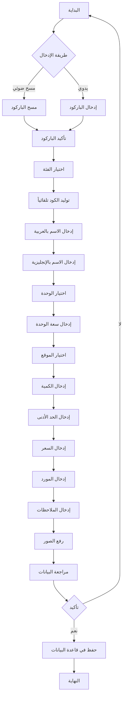
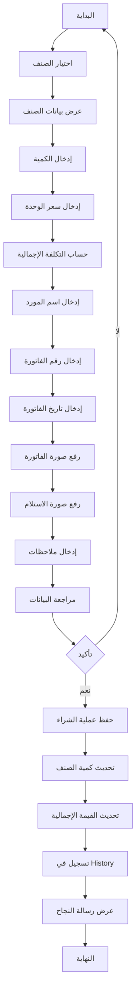
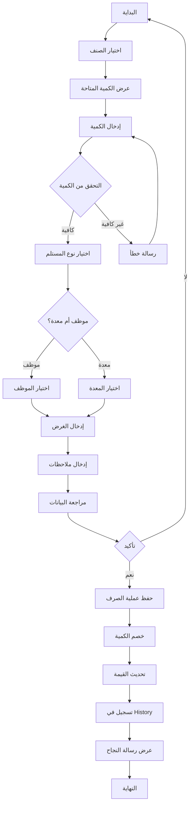
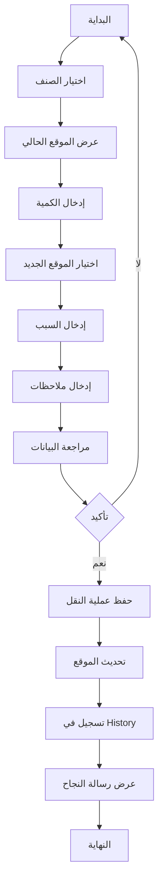
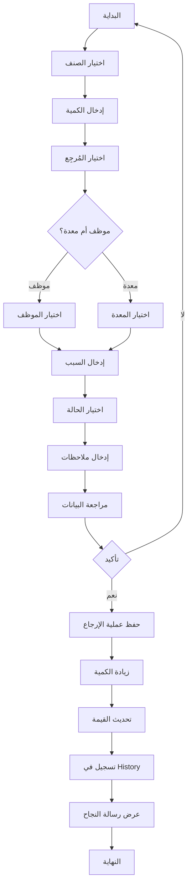
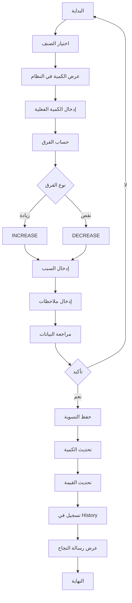

# 🔄 تدفقات العمل الكاملة - نظام المخازن

## 📋 جميع التدفقات (27 تدفق)

---

## 🛢️ الزيوت والشحوم (12 تدفق)

### 1. إضافة صنف جديد

**الخطوات التفصيلية:**

1. **البداية** - المستخدم يختار "إضافة صنف جديد"
2. **طريقة الإدخال** - مسح ضوئي أو يدوي
3. **مسح الباركود** - استخدام الكاميرا + BarcodeScannerService
4. **إدخال يدوي** - كتابة الباركود (8-13 رقم)
5. **تأكيد الباركود** - التحقق من عدم التكرار
6. **اختيار الفئة** - من قائمة الفئات النشطة
7. **توليد الكود** - تلقائياً (ENG-001, HYD-002)
8. **الاسم بالعربية** - نص عربي (3-100 حرف)
9. **الاسم بالإنجليزية** - اختياري
10. **اختيار الوحدة** - لتر، جالون، برميل، كيلو، علبة
11. **سعة الوحدة** - رقم موجب (للجالون والبرميل)
12. **اختيار الموقع** - من قائمة المواقع النشطة
13. **الكمية** - رقم موجب أو صفر
14. **الحد الأدنى** - للتنبيهات
15. **السعر** - سعر الوحدة
16. **المورد** - اسم وجوال المورد
17. **الملاحظات** - نص حر
18. **رفع الصور** - صورة أو أكثر
19. **المراجعة** - عرض جميع البيانات
20. **الحفظ** - INSERT في INV_OilsGreasesItem

**الجداول المستخدمة:**
- INV_OilsGreasesItem (INSERT)
- INV_OilsGreasesCategory (SELECT)
- INV_StorageLocation (SELECT)
- INV_ItemHistory (INSERT - تسجيل CREATE)

---

### 2. عملية شراء

**الخطوات:**

1. اختيار الصنف (بحث أو قائمة)
2. عرض: الاسم، الكود، الكمية الحالية، السعر الحالي
3. إدخال الكمية المشتراة
4. إدخال سعر الوحدة
5. حساب: totalCost = quantity × unitPrice
6. إدخال اسم المورد
7. إدخال رقم الفاتورة
8. إدخال تاريخ الفاتورة
9. رفع صورة الفاتورة (اختياري)
10. رفع صورة بون الاستلام (اختياري)
11. إدخال ملاحظات (اختياري)
12. مراجعة جميع البيانات
13. التأكيد
14. حفظ في INV_OilsGreasesPurchase
15. تحديث: quantity += purchaseQuantity
16. تحديث: totalValue = quantity × unitPrice
17. تسجيل في INV_ItemHistory
18. عرض رسالة نجاح

**الجداول المستخدمة:**
- INV_OilsGreasesPurchase (INSERT)
- INV_OilsGreasesItem (UPDATE quantity, totalValue)
- INV_ItemHistory (INSERT)

---

### 3. عملية صرف

**الخطوات:**

1. اختيار الصنف
2. عرض الكمية المتاحة
3. إدخال الكمية المطلوبة
4. التحقق: quantity <= availableQuantity
5. اختيار نوع المستلم (موظف/معدة)
6. إذا موظف: اختيار من قائمة الموظفين
7. إذا معدة: اختيار من قائمة المعدات
8. إدخال الغرض من الصرف
9. إدخال ملاحظات
10. مراجعة البيانات
11. التأكيد
12. حفظ في INV_OilsGreasesIssuance
13. خصم: quantity -= issuedQuantity
14. تحديث: totalValue = quantity × unitPrice
15. تسجيل في INV_ItemHistory
16. عرض رسالة نجاح

**الجداول المستخدمة:**
- INV_OilsGreasesIssuance (INSERT)
- INV_OilsGreasesItem (UPDATE quantity, totalValue)
- Employee (SELECT - إذا موظف)
- Equipment (SELECT - إذا معدة)
- INV_ItemHistory (INSERT)

---

### 4. عملية نقل

**الخطوات:**

1. اختيار الصنف
2. عرض الموقع الحالي والكمية
3. إدخال الكمية المراد نقلها
4. اختيار الموقع الجديد
5. إدخال سبب النقل
6. إدخال ملاحظات
7. مراجعة البيانات
8. التأكيد
9. حفظ في INV_OilsGreasesTransfer
10. تحديث locationId في INV_OilsGreasesItem
11. تسجيل في INV_ItemHistory
12. عرض رسالة نجاح

**الجداول المستخدمة:**
- INV_OilsGreasesTransfer (INSERT)
- INV_OilsGreasesItem (UPDATE locationId)
- INV_StorageLocation (SELECT)
- INV_ItemHistory (INSERT)

---

### 5. عملية إرجاع

**الخطوات:**

1. اختيار الصنف
2. إدخال الكمية المرتجعة
3. اختيار المُرجِع (موظف/معدة)
4. إدخال سبب الإرجاع (إلزامي)
5. اختيار حالة المرتجع (GOOD, DAMAGED, EXPIRED)
6. إدخال ملاحظات
7. مراجعة البيانات
8. التأكيد
9. حفظ في INV_OilsGreasesReturn
10. زيادة: quantity += returnedQuantity
11. تحديث: totalValue = quantity × unitPrice
12. تسجيل في INV_ItemHistory
13. عرض رسالة نجاح

**الجداول المستخدمة:**
- INV_OilsGreasesReturn (INSERT)
- INV_OilsGreasesItem (UPDATE quantity, totalValue)
- Employee (SELECT)
- Equipment (SELECT)
- INV_ItemHistory (INSERT)

---

### 6. عملية تسوية (جرد)

**الخطوات:**

1. اختيار الصنف
2. عرض الكمية في النظام
3. إدخال الكمية الفعلية (من الجرد)
4. حساب الفرق: difference = actual - system
5. تحديد النوع: INCREASE أو DECREASE
6. إدخال سبب التسوية (إلزامي)
7. إدخال ملاحظات
8. مراجعة البيانات
9. التأكيد
10. حفظ في INV_OilsGreasesAdjustment
11. تحديث: quantity = actualQuantity
12. تحديث: totalValue = quantity × unitPrice
13. تسجيل في INV_ItemHistory
14. عرض رسالة نجاح

**الجداول المستخدمة:**
- INV_OilsGreasesAdjustment (INSERT)
- INV_OilsGreasesItem (UPDATE quantity, totalValue)
- INV_ItemHistory (INSERT)

---

### 7-12. باقي الوظائف

**7. عرض قائمة الأصناف**
- SELECT من INV_OilsGreasesItem
- Pagination (8 items/page)
- فلترة حسب الفئة/الموقع/الحالة

**8. تعديل صنف**
- SELECT البيانات الحالية
- تعديل الحقول
- UPDATE في INV_OilsGreasesItem
- تسجيل في INV_ItemHistory

**9. البحث عن صنف**
- البحث بالكود/الباركود/الاسم
- عرض النتائج

**10. عرض تفاصيل صنف**
- SELECT جميع البيانات
- عرض العلاقات (الفئة، الموقع)
- عرض آخر العمليات

**11. تنبيهات النقص**
- SELECT حيث quantity <= minQuantity
- عرض القائمة مع التنبيهات

**12. تصدير Excel**
- SELECT جميع الأصناف
- تحويل إلى Excel
- تحميل الملف

---

## 🔧 قطع الغيار (15 تدفق)

### نفس التدفقات مع اختلافات:

**الاختلافات الرئيسية:**

1. **الكميات المتعددة:**
   - quantityNew
   - quantityUsed
   - quantityRefurbished
   - quantityImport

2. **الجداول:**
   - INV_SparePart
   - INV_SparePartTransaction
   - INV_SparePartUsage
   - INV_DamageRecord

3. **الحقول الإضافية:**
   - partNumber
   - manufacturer
   - model
   - yearFrom/yearTo
   - compatibleEquipmentTypes

4. **التقارير الإضافية:**
   - سجل التالف (Damage Records)
   - تقرير الاستخدام (Usage Report)
   - تقرير القيمة (Value Report)

---

## 📊 ملخص التدفقات

| الوظيفة | الجداول المستخدمة | عدد الخطوات |
|---------|-------------------|-------------|
| إضافة صنف | 4 جداول | 20 خطوة |
| شراء | 3 جداول | 18 خطوة |
| صرف | 5 جداول | 16 خطوة |
| نقل | 4 جداول | 12 خطوة |
| إرجاع | 5 جداول | 13 خطوة |
| تسوية | 3 جداول | 14 خطوة |

---

**آخر تحديث:** 2025-01-17  
**الحالة:** ✅ مكتمل - جميع التدفقات موثقة
