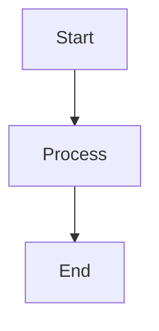

# 📚 دليل الوظائف الشامل - Inventory Management Functions Reference

## 🎯 نظرة عامة

هذا الدليل يحتوي على توثيق احترافي شامل لجميع وظائف نظام إدارة المخازن في بوت السعادة ERP.

---

## 📋 فهرس الوظائف

### 🛢️ مخزن الزيوت والشحوم (Oils & Greases)

#### 📦 إدارة الأصناف (Items Management)
1. [إضافة صنف جديد](./01-items-add.md) - Add Item
2. [عرض قائمة الأصناف](./02-items-list.md) - List Items
3. [تعديل صنف](./03-items-edit.md) - Edit Item
4. [البحث عن صنف](./04-items-search.md) - Search Item
5. [عرض تفاصيل صنف](./05-items-view.md) - View Item

#### 🔄 المعاملات (Transactions)
6. [عملية شراء](./06-transaction-purchase.md) - Purchase
7. [عملية صرف](./07-transaction-issue.md) - Issue
8. [عملية نقل](./08-transaction-transfer.md) - Transfer
9. [عملية إرجاع](./09-transaction-return.md) - Return
10. [عملية تسوية](./10-transaction-adjust.md) - Adjust
11. [سجل الحركات](./11-transaction-list.md) - Transaction List

#### 📊 التقارير (Reports)
12. [تنبيهات المخزون](./12-report-alerts.md) - Stock Alerts
13. [تصدير البيانات](./13-report-export.md) - Data Export
14. [ملخص المخزون](./14-report-summary.md) - Inventory Summary
15. [قيمة المخزون](./15-report-value.md) - Inventory Value

#### ⚙️ الإعدادات (Settings)
16. [إدارة الفئات](./16-settings-categories.md) - Categories Management
17. [إدارة المواقع](./17-settings-locations.md) - Locations Management

---

## 🔧 قطع الغيار (Spare Parts)

#### 📦 إدارة الأصناف
18. [إضافة قطعة غيار](./18-spare-add.md) - Add Spare Part
19. [قائمة قطع الغيار](./19-spare-list.md) - List Spare Parts
20. [تعديل قطعة غيار](./20-spare-edit.md) - Edit Spare Part
21. [البحث عن قطعة](./21-spare-search.md) - Search Spare Part
22. [تفاصيل قطعة](./22-spare-view.md) - View Spare Part

#### 🔄 المعاملات
23. [شراء قطع غيار](./23-spare-purchase.md) - Purchase
24. [صرف قطع غيار](./24-spare-issue.md) - Issue
25. [نقل قطع غيار](./25-spare-transfer.md) - Transfer
26. [إرجاع قطع غيار](./26-spare-return.md) - Return
27. [تسوية قطع غيار](./27-spare-adjust.md) - Adjust

---

## 📖 كيفية استخدام هذا الدليل

### 🎨 رموز الحالة
- ✅ **مكتمل ومختبر** - الوظيفة جاهزة للإنتاج
- 🚧 **قيد التطوير** - الوظيفة تحت التطوير
- 📝 **مخطط** - الوظيفة في مرحلة التخطيط
- ⚠️ **يحتاج مراجعة** - الوظيفة تحتاج تحسين

### 📊 مستويات الأولوية
- 🔴 **عالية** - وظيفة أساسية
- 🟡 **متوسطة** - وظيفة مهمة
- 🟢 **منخفضة** - وظيفة إضافية

### 🔐 مستويات الصلاحيات
- **OWNER** - مالك النظام
- **ADMIN** - مدير النظام
- **MANAGER** - مدير القسم
- **EMPLOYEE** - موظف

---

## 📐 هيكل التوثيق

كل وظيفة موثقة بالشكل التالي:

### 1. معلومات عامة
- اسم الوظيفة
- الكود
- المسار
- النوع
- الصلاحيات

### 2. الغرض والوصف
- ماذا تفعل الوظيفة
- متى تستخدم
- الفوائد

### 3. تدفق العمل
- مخطط Mermaid
- الخطوات التفصيلية
- نقاط القرار

### 4. قاعدة البيانات
- الجداول المستخدمة
- الحقول
- العلاقات

### 5. التحقق من البيانات
- قواعد Validation
- رسائل الخطأ
- الحدود

### 6. واجهة المستخدم
- الأزرار
- الرسائل
- الأيقونات

### 7. الخدمات المستخدمة
- Services
- Utils
- APIs

### 8. أمثلة الاستخدام
- سيناريوهات حقيقية
- خطوات التنفيذ

### 9. الاختبار
- Test Cases
- النتائج المتوقعة

### 10. المراجع
- روابط ذات صلة
- توثيق إضافي

---

## 🛠️ أدوات التوثيق المستخدمة

### Mermaid Diagrams


### Code Blocks
```typescript
// TypeScript code examples
const example = "code"
```

### Tables
| Column 1 | Column 2 |
|----------|----------|
| Data 1   | Data 2   |

### Alerts
> ⚠️ **تحذير:** معلومة مهمة
> 
> ℹ️ **ملاحظة:** معلومة إضافية
> 
> ✅ **نجاح:** عملية ناجحة

---

## 📊 إحصائيات التوثيق

| المقياس | القيمة |
|---------|--------|
| إجمالي الوظائف | 27 وظيفة |
| الوظائف الموثقة | 17 وظيفة |
| نسبة الإكمال | 63% |
| آخر تحديث | 2025-01-17 |

---

## 🔄 سجل التحديثات

### الإصدار 1.0.0 (2025-01-17)
- ✅ إنشاء هيكل التوثيق
- ✅ توثيق وظائف Oils & Greases
- 🚧 توثيق وظائف Spare Parts

### الإصدار 0.9.0 (2025-01-16)
- ✅ إنشاء Shared Services
- ✅ إعادة هيكلة المشروع

---

## 📞 الدعم والمساعدة

للحصول على المساعدة:
1. راجع التوثيق الخاص بالوظيفة
2. تحقق من [Testing Plan](../testing-plan.md)
3. راجع [API Reference](../api/)
4. اتصل بفريق التطوير

---

## 🎓 للمطورين الجدد

### خطوات البدء
1. اقرأ [Project Overview](../README.md)
2. راجع [Development Guidelines](../../../../.amazonq/rules/memory-bank/guidelines.md)
3. افهم [Project Structure](../../../../.amazonq/rules/memory-bank/structure.md)
4. ابدأ بوظيفة بسيطة مثل [View Item](./05-items-view.md)

### أفضل الممارسات
- اتبع معايير الكود الموجودة
- استخدم Shared Services
- اكتب Tests
- وثق التغييرات

---

**آخر تحديث:** 2025-01-17  
**المسؤول:** فريق التطوير  
**الحالة:** 🚧 قيد التطوير المستمر
